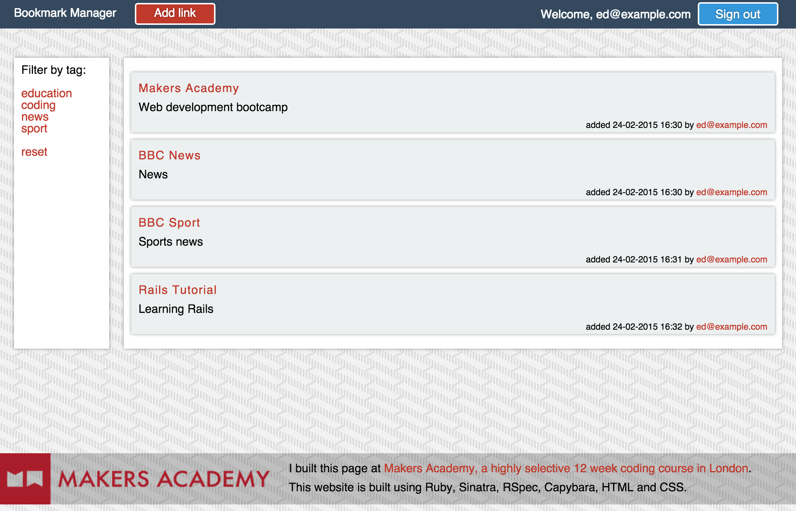

# Bookmark Manager

## Summary

This was the Week 4 project at Makers Academy. It is a bookmark manager application, similar to pineapple.io or delicious.com in spirit.

The live version of the site is available [here](https://eds-bookmark-manager.herokuapp.com).

The focus of the week was to learn how to use relational databases and how to integrate them into a web framework with an object relational mapper. A bookmark manager is a good use case for exploring how relational databases work, with its basic functionality being as follows:

- Allow a user to add links
- Show a list of links from the database and who added them
- Add tags to the links
- Filter links by a tag

We also learnt important principles of website security, including:

- Allow a user to sign up, sign in and sign out
- Preventing duplication registrations
- Password encryption
- Password validation
- Automated password reset emails and tokens

## Technologies used

- Ruby
- Sinatra
- PostgreSQL
- DataMapper
- Bcrypt
- RSpec
- Capybara
- HTML
- CSS

## Screenshot



## Instructions

To try the app locally, please clone this repository on your machine:
```
$ git clone https://github.com/ejbyne/bookmark-manager.git
```

Change into the directory and install the Ruby gems:
```
$ cd bookmark-manager
$ bundle install
```

Start the Sinatra server:
```
$ rackup
```

Visit http://localhost:9292.

Run the tests:
```
$ rspec
```
